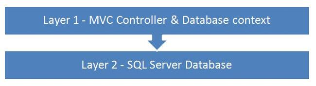
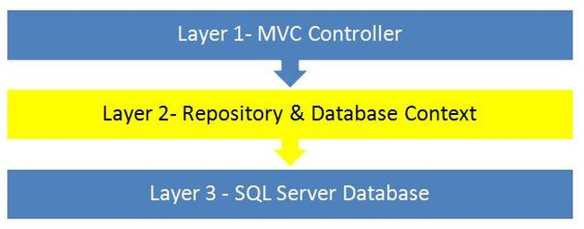

# LetsDate

LetsDate is a dating platform which contains almost every feature like the other dating services, but maybe that's could be your choice.

### Tech Stack - Backend

- .NET 5
- Repository Pattern
- SignalR
- AutoMapper
- Swagger
- Entity Framework Core
- Identity and Authentication
- Security with JSON Web Token
- Cloudinary

### Tech Stack - Frontend

- Angular
- Angular Forms
- Ngx-Gallery
- Microsoft/SignalR
- Ng2-File-Upload
- Ngx-Bootstrap
- Ngx-Spinner
- Ngx-Timeago
- Ngx-Toastr
- Ngx-Bootstrap
- Ngx-Bootstrap/datepicker
- Ngx-Bootstrap/pagination
- Ngx-Bootstrap/dropdown

### The Repository pattern

Repositories are classes or components that encapsulate the logic required to access data sources. They centralize common data access functionality, providing better maintainability and decoupling the infrastructure or technology used to access databases from the domain model layer. If you use an Object-Relational Mapper (ORM) like Entity Framework, the code that must be implemented is simplified, thanks to LINQ and strong typing. This lets you focus on the data persistence logic rather than on data access plumbing.

As long as we are getting the correct results, we are not concerned with how the application code is structured, what the various layers defined are, how they interact, how they pass the required data among them and so on and in most of the cases, we use the database context directly inside the controllers. This creates tight coupling between the controller and the data access layer and if we look closely into this type of code, it violates the Single Responsibility Principle as well as Open close principle. Any change related to the data-access layer can break the controller code. In such a case, our code structure has the following layers:

As seen from the preceding structure, layer 1 is using the database context directly and connects with the SQL Server. This is where the repository pattern can be implemented, to separate the layers. Our purpose will be to separate the controller and the data access layer (database context) using an intermediate layer, in other words repository layer, for communication between the two. So our code structure now changes to the following:

### Unit Of Work

It acts as the mediator between the MVC controller and the generic repository, to do all the database transactions in a single go.

(For Example: The advantage of using this class is the fact that when we are doing multiple operations in one single controller method, we will be committing all the changes in the database by calling the SaveChanges only once and that is through the Unit Of Work instance. )

### SignalR

ASP.NET SignalR is a library for ASP.NET developers that makes it incredibly simple to add real-time web functionality to your applications. What is "real-time web" functionality? It's the ability to have your server-side code push content to the connected clients as it happens, in real-time.

( In this app we are using SignalR to handle the "Online Now status" for users and also to handle the messenger functionalities. )

### Endpoints of the Backend

| Entity         | Type   | URL                                                                | Description                                                               | Success                                                | Authorize                     |
| -------------- | ------ | ------------------------------------------------------------------ | ------------------------------------------------------------------------- | ------------------------------------------------------ | ----------------------------- |
| Account        | POST   | /api/account/login                                                 | Login with your account.                                                  | 200 OK                                                 | No                            |
|                | POST   | /api/account/register                                              | Create a account.                                                         | 200 OK                                                 | No                            |
|                | POST   | /api/account/refreshToken                                          | User token refresh.                                                       | 200 OK                                                 | Yes                           |
|                | GET    | /api/account                                                       | Get the current logged in user information like token, main image etc.... | 200 OK                                                 | Yes                           |
| Admin          | GET    | /api/admin/users-with-roles                                        | As admin get all users with their roles (admin, moderator, member).       | 200 OK                                                 | Yes & Admin role              |
|                | POST   | /api/admin/edit-roles/{username}?roles={with comma separation (,)} | Modify a user role.                                                       | 200 OK                                                 | Yes & Admin role              |
|                | GET    | /api/admin/photos-to-moderate                                      | Get all unapproved photo.                                                 | 200 OK                                                 | Yes & Moderator or Admin role |
|                | POST   | /api/admin/approve-photo/{photoId}                                 | Approve a photo.                                                          | 200 OK                                                 | Yes & Moderator or Admin role |
|                | POST   | /api/admin/reject-photo/{photoId}                                  | Reject a photo.                                                           | 200 OK                                                 | Yes & Moderator or Admin role |
| User           | GET    | /api/users                                                         | Get all users.                                                            | 200 OK                                                 | Yes                           |
|                | GET    | /api/users?pageNumber={1}&PageSize={5}                             | Get all users and set to the {1} page, and every page size is {5}.        | 200 OK                                                 | Yes                           |
|                | GET    | /api/users?gender={female}                                         | Get all {female} users.                                                   | 200 OK                                                 | Yes                           |
|                | GET    | /api/users?minAge={18}&maxAge={35}                                 | Get all users with age parameters.                                        | 200 OK                                                 | Yes                           |
|                | GET    | /api/users?orderBy={created or lastActive}                         | Get all users by account created / lastActive information.                | 200 OK                                                 | Yes                           |
|                | GET    | /api/users?orderBy={lastActive}&gender={female}                    | Get all users with order and gender query parameters.                     | 200 OK                                                 | Yes                           |
|                | GET    | /api/users/{username}                                              | Get user by username.                                                     | 200 OK                                                 | Yes                           |
|                | PUT    | /api/users                                                         | Edit the current logged in user data.                                     | 200 OK                                                 | Yes                           |
| User Photo     | POST   | /api/photos                                                        | Upload a photo.                                                           | 201 Created (location header to /api/users/{username}) | Yes                           |
|                | DELETE | /api/photos/{photoId}                                              | Delete a photo, the user cannot delete the current main photo.            | 200 OK                                                 | Yes                           |
|                | PUT    | /api/photos/{photoId}/setmain                                      | Set the photo to main. (Only one main - profile picture).                 | 200 OK                                                 | Yes                           |
| User Like      | POST   | /api/likes/{username}                                              | Like / Unlike a user.                                                     | 200 OK                                                 | Yes                           |
|                | GET    | /api/likes?predicate={liked}                                       | Current logged in user liked them.                                        | 200 OK                                                 | Yes                           |
|                | GET    | /api/likes?predicate={likedBy}                                     | They liked the current logged in user.                                    | 200 OK                                                 | Yes                           |
| User Messenger | DELETE | /api/messages/{messageId}                                          | Delete message as sender && Blank it as recipient (only for yourself).    | 200 OK                                                 | Yes                           |
|                | GET    | /api/messages/thread/{username}                                    | Logged in user MessageThread with {username}.                             | 200 OK                                                 | Yes                           |
|                | GET    | /api/messages                                                      | Get unread messages.                                                      | 200 OK                                                 | Yes                           |
|                | GET    | /api/messages?container={Outbox}                                   | Get outbox messages (messages send by you).                               | 200 OK                                                 | Yes                           |
|                | GET    | /api/messages?container={Inbox}                                    | Get inbox messages (your received messages).                              | 200 OK                                                 | Yes                           |
